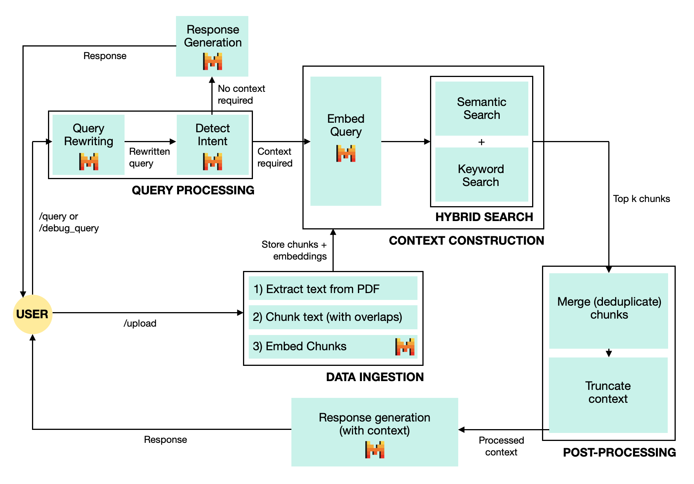

# Retrieval-Augmented Generation (RAG) with FastAPI and Mistral

This project implements a simple RAG (Retrieval-Augmented Generation) pipeline using **FastAPI** and the **Mistral AI API**. The system allows users to upload PDFs, process them into retrievable text chunks, and then query the knowledge base with enhanced natural language questions.

## Project Structure
```

rag-fastapi-mistral/
├── app/
│   ├── main.py                # FastAPI app with /upload, /query, /debug_query endpoints
│   ├── ingestion.py           # PDF saving, text extraction, and chunking
│   ├── search.py              # Hybrid search 
│   ├── postprocessing.py      # Deduplication, truncation
│   ├── mistral_utils.py       # Mistral API integration (transform, classify, generate)
│   └── storage.py             # In-memory store of chunk metadata and embeddings
│
├── tests/
│   ├── test_ingestion.py      # Unit tests for chunking
│   ├── test_postprocessing.py # Unit tests for deduplication, truncation
│   └── test_search.py         # Unit tests for similarity & keyword extraction
│
├── requirements.txt           # Python dependencies
├── .gitignore                 # Ignore PDFs, .env, __pycache__, etc.
├── system-diagram.png         # System architecture
└── README.md                  # Project overview and instructions

```
## System Design



This modular setup allows for easy substitution of models, reranking strategies, or chunking methods without rewriting core components.

### Key Design Choices

- **No external RAG or search libraries used**  
  All retrieval, chunk embedding, similarity scoring, and reranking logic is implemented manually using only the official Mistral SDK — no third-party libraries were used.

- **No third-party vector database**  
  Embeddings are stored in memory and scored manually using cosine similarity for transparency and flexibility.

- **Weighted hybrid search**  
  Initially implemented as keyword filtering followed by semantic search, the retrieval strategy was redesigned into a weighted scoring model after evaluation showed that filtering excluded important chunks. The final approach combines semantic similarity and keyword overlap using a tunable `alpha` parameter (default: `0.75`), selected by testing various values on representative files and queries to optimize both accuracy and file diversity.

- **Modular filtering**  
  Post-processing steps like deduplication and truncation are cleanly separated to allow experimentation. Deduplication removes identical chunks (often introduced when the same file is uploaded more than once) to avoid biasing the context and wasting tokens. Truncation ensures the total context stays within token limits, especially when users choose larger chunk sizes.

- **LLM-enhanced query handling**  
  The system uses Mistral to:
  - Rewrite queries for clarity
  - Classify intent (whether to trigger retrieval)
  - Embed queries and document chunks using `mistral-embed` for semantic search
  - Generate final answers with or without context

- **Debug-first development**  
  A dedicated `/debug_query` endpoint reveals each stage of the pipeline to aid in testing, evaluation, and iteration.

## API Endpoints

### `/upload` — Upload PDFs

**Method:** `POST`  
**Description:** Upload one or more PDF files to be processed into retrievable chunks.

#### Form Data

| Parameter     | Type         | Required | Description                                          |
|---------------|--------------|----------|------------------------------------------------------|
| `files`       | file[]       | Yes      | One or more `.pdf` files to ingest                   |
| `chunk_size`  | int          | No       | Number of characters per chunk (default: 500)        |
| `overlap`     | int          | No       | Overlapping characters between chunks (default: 100) |

**Response Example:**
```
{
  "status": "success",
  "files": [
    {
      "filename": "example.pdf",
      "chunks_created": 24,
      "chunk_size": 500,
      "overlap": 100
    }
  ]
}
```
---
### `/query` — Ask a Question

**Method:** `POST`  
**Description:** Query the knowledge base using natural language. The system will determine if knowledge base context is needed and respond accordingly.

#### Form Data

| Parameter     | Type         | Required | Description                                          |
|---------------|--------------|----------|------------------------------------------------------|
| `question`    | string       | Yes      | The user’s input question                            |
---
### `/debug_query` — Trace a Query

**Method:** `POST`  
**Description:** Same as `/query`, but returns detailed debug information about each stage of the pipeline.

#### Form Data

| Parameter     | Type         | Required | Description                                          |
|---------------|--------------|----------|------------------------------------------------------|
| `question`    | string       | Yes      | The user’s input question                            |

**Response Example (trimmed):**
Note that chunks are shown up to 250 characters.
```
{
  "original_query": "How do teams and motivation interact?",
  "transformed_query": "How do team structure and motivation influence performance?",
  "used_knowledge_base": true,
  "initial_top_chunks": [
    { "filename": "teams.pdf", "text_preview": "..." }
  ],
  "after_deduplication": [...],
  "after_truncation": [...],
  "top_chunks_count": 5,
  "response": "LLM-generated answer"
}

```

## Setup Instructions

### 1. Clone the repository
```
git clone https://github.com/yw9211/rag-fastapi-mistral.git
cd rag-fastapi-mistral
```

### 2. Create and activate a virtual environment
```
python3 -m venv env-rag
source env-rag/bin/activate  # On macOS/Linux

# For Windows:
# .\env-rag\Scripts\activate
```

### 3. Install Python dependencies
```
pip install -r requirements.txt
```

### 4. Set your Mistral API Key

Create a .env file in the root directory with the following:
```
MISTRAL_API_KEY=[your-api-key-here]
```

### 5. Run the FastAPI server
```
uvicorn app.main:app --reload
```
Visit: http://localhost:8000/docs to test endpoints.

## Running Unit Tests

This project uses [`pytest`](https://docs.pytest.org/) for unit testing. To run all tests:

```
PYTHONPATH=. pytest
```